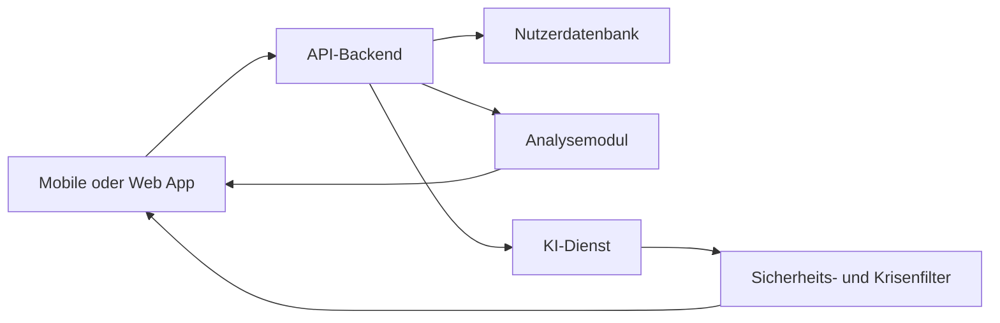

# Projektplan: KI-Health-App für emotionale Gesundheit

## 1. Zielbild

Die App soll Menschen dabei unterstützen, die Auswirkungen ihrer KI-Nutzung auf ihr emotionales Wohlbefinden zu erkennen. Sie stellt keine Diagnosen und ersetzt keine psychologische oder medizinische Behandlung.

**Mögliche Leitfrage:**

> Wie beeinflusst die Nutzung von Chatbots, Empfehlungssystemen und generativer KI meine Stimmung, mein Selbstbild und meine sozialen Beziehungen?

Aus Sicht eines Informatikers liegt der Schwerpunkt auf:

- messbaren Nutzungsmustern
- verständlicher Datenanalyse
- Datenschutz und IT-Sicherheit
- verantwortungsvoller KI
- transparenter, überprüfbarer Software

## 2. Zielgruppe und Anwendungsfälle

Primäre Zielgruppe sind Jugendliche und Erwachsene, die regelmäßig KI-Systeme nutzen.

Zentrale Anwendungsfälle:

1. Nutzer dokumentieren Stimmung und KI-Nutzung.
2. Die App erkennt zeitliche Zusammenhänge, beispielsweise zwischen intensiver Chatbot-Nutzung und Einsamkeit.
3. Nutzer erhalten persönliche Reflexionsfragen und niedrigschwellige Empfehlungen.
4. Ein Dashboard zeigt Entwicklungen, ohne medizinische Diagnosen abzuleiten.
5. Bei Krisensignalen verweist die App auf professionelle Hilfsangebote.

## 3. MVP-Funktionen

Für eine erste funktionsfähige Version:

- täglicher Stimmungs-Check-in
- Erfassung von Dauer, Zweck und Art der KI-Nutzung
- Tagebuch mit optionaler KI-gestützter Zusammenfassung
- Wochenübersicht mit Trends und Korrelationen
- Reflexionsfragen wie „Hat dir die KI-Nutzung heute geholfen oder dich belastet?“
- Einstellungen für Einwilligung, Datenexport und Datenlöschung
- Krisenhinweise mit regionalen Hilfsangeboten
- klare Erklärung, wie Ergebnisse zustande kommen

Noch nicht Teil des MVP:

- automatische Diagnose psychischer Erkrankungen
- Therapieempfehlungen
- permanente Überwachung anderer Apps
- Emotionserkennung über Kamera oder Mikrofon
- soziale Vergleichswerte oder Rankings

## 4. Messkonzept

Jeder Check-in könnte folgende Werte erfassen:

- Stimmung
- Stress
- Einsamkeit
- Selbstwertgefühl
- Schlafqualität
- Dauer der KI-Nutzung
- Nutzungszweck: Arbeit, Lernen, Unterhaltung oder emotionale Unterstützung
- subjektive Wirkung: hilfreich, neutral oder belastend

Technisch sinnvoll ist zunächst eine regelbasierte Auswertung. Beispiel:

> An Tagen mit mehr als zwei Stunden KI-Nutzung hast du häufiger erhöhten Stress angegeben.

Dabei muss die App deutlich machen:

- Korrelation ist keine Kausalität.
- Die Datenmenge kann zu klein sein.
- Selbstberichte sind subjektiv.
- Ergebnisse sind Hinweise zur Reflexion, keine Diagnosen.

## 5. Technische Architektur

Eine pragmatische Architektur:

Möglicher Technologie-Stack:

- Frontend: React Native oder Flutter
- Backend: Python mit FastAPI oder TypeScript mit NestJS
- Datenbank: PostgreSQL
- Authentifizierung: passwortlos oder OAuth
- Diagramme: Recharts, Victory oder fl_chart
- KI-Komponente: Sprachmodell mit strukturierten Ausgaben
- Betrieb: europäische Cloud-Region, verschlüsselte Speicherung und TLS

Die Kernanalyse sollte auch ohne generative KI funktionieren. Das Sprachmodell formuliert dann lediglich verständliche Zusammenfassungen und Reflexionsfragen.

## 6. Datenschutz und Sicherheit

Da Gesundheitsbezug und emotionale Daten besonders sensibel sind:

- Datensparsamkeit als Grundeinstellung
- lokale Verarbeitung, soweit möglich
- getrennte Speicherung von Identität und Gesundheitsdaten
- Verschlüsselung während Übertragung und Speicherung
- keine Nutzung persönlicher Daten zum Modelltraining
- ausdrückliche Einwilligung für jede optionale Datenquelle
- vollständiger Datenexport und Löschung
- kurze Speicherfristen
- rollenbasierte Zugriffe und Audit-Logs
- Bedrohungsmodell für Datenlecks, Prompt Injection und Kontenübernahme

Vor einer Veröffentlichung sollten DSGVO, Medizinprodukterecht und Jugendschutz fachjuristisch geprüft werden.

## 7. Verantwortungsvolle KI

Für die KI-Komponente gelten feste Grenzen:

- keine Diagnosen
- keine Medikamentenempfehlungen
- keine Behauptung menschlicher Gefühle oder therapeutischer Kompetenz
- keine emotional manipulierende Bindung
- keine Aufforderung, menschliche Kontakte durch KI zu ersetzen
- sichtbare Unsicherheitsangaben
- Krisensituationen nicht allein durch ein Sprachmodell bewerten

Krisenhinweise sollten durch konservative Regeln, geprüfte Inhalte und menschlich definierte Eskalationspfade abgesichert werden.

## 8. Entwicklungsphasen

| Phase | Dauer | Ergebnis |
|---|---:|---|
| Recherche und Problemdefinition | 2 Wochen | Zielgruppe, Risiken und Anforderungen |
| UX-Konzept und Prototyp | 2–3 Wochen | Klickbarer Prototyp und Nutzerabläufe |
| Technisches Design | 1–2 Wochen | Architektur, Datenmodell und Sicherheitskonzept |
| MVP-Entwicklung | 6–8 Wochen | Check-ins, Tagebuch, Dashboard und Analyse |
| Tests und Evaluation | 3–4 Wochen | Usability-, Sicherheits- und Qualitätstests |
| Pilotphase | 4–6 Wochen | Erprobung mit kleiner Nutzergruppe |
| Überarbeitung und Veröffentlichung | 2–4 Wochen | Verbesserte, dokumentierte Version |

## 9. Evaluation

### Technische Kennzahlen

- Fehlerrate und Verfügbarkeit
- Antwortzeit
- Genauigkeit der Berechnungen
- Anzahl fehlerhafter oder riskanter KI-Antworten
- Rate falscher Krisenhinweise
- erfolgreiche Datenexporte und Löschungen

### Nutzerbezogene Kennzahlen

- regelmäßige Check-ins
- Verständlichkeit der Auswertungen
- wahrgenommene Nützlichkeit
- Veränderungen im Bewusstsein für KI-Nutzungsmuster
- Auftreten von Abhängigkeit, Schuldgefühlen oder zusätzlichem Stress

Die Bewertung sollte möglichst gemeinsam mit Psychologen, Datenschutzexperten und Mitgliedern der Zielgruppe erfolgen.

## 10. Sinnvolle Projektgliederung

Für eine Bachelorarbeit, Projektarbeit oder ein Portfolio-Projekt eignet sich folgende Struktur:

1. Auswirkungen von KI auf emotionale Gesundheit untersuchen
2. Anforderungen und ethische Risiken ableiten
3. Systemarchitektur und Sicherheitsmodell entwerfen
4. MVP implementieren
5. regelbasierte und KI-gestützte Analyse vergleichen
6. Usability und technische Qualität evaluieren
7. Grenzen und zukünftige Erweiterungen diskutieren

Ein realistisches Endprodukt wäre ein datenschutzorientiertes Reflexionswerkzeug, das Zusammenhänge sichtbar macht – nicht eine KI-Therapeutin.
